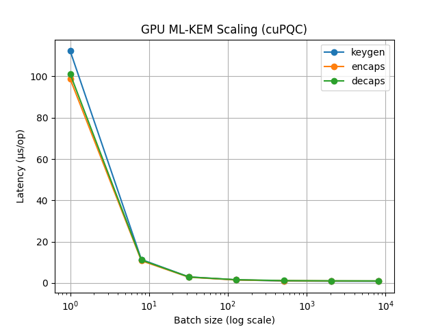
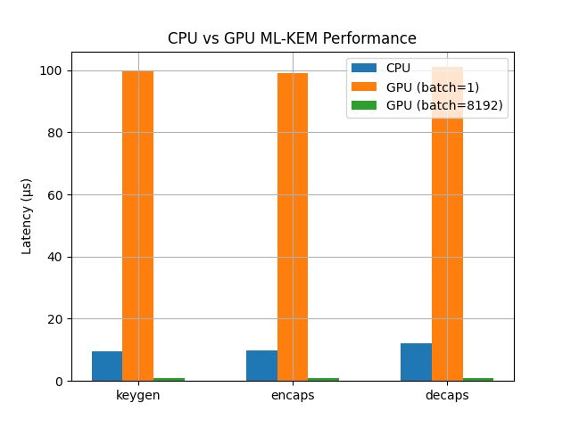
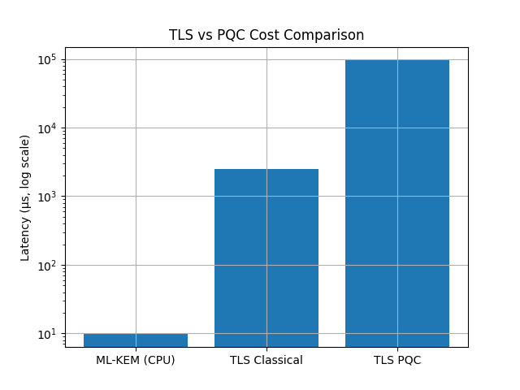

# 🔐 PQC TLS Benchmark — Classical vs Post-Quantum Cryptography (CPU & GPU)

## 📄 Abstract

This work presents a multi-layer evaluation of post-quantum cryptography (PQC) in TLS, combining protocol-level benchmarks with low-level cryptographic performance analysis on both CPU and GPU platforms.

Experimental results show that hybrid PQC TLS introduces significant latency overhead (~93 ms) during full handshakes, while the underlying cryptographic primitives execute in microseconds. GPU acceleration improves throughput under high concurrency but does not reduce handshake latency.

These findings highlight that the primary performance challenges of PQC adoption lie in protocol design rather than computational cost.

---

# 📌 Overview

This repository presents a **comprehensive experimental evaluation of PQC in TLS**, combining:

* 🔐 Classical TLS (OpenSSL / AWS-LC)
* 🔐 Hybrid PQC TLS (X25519 + ML-KEM-768)
* ⚙️ CPU-based PQC primitives (liboqs)
* 🚀 GPU-accelerated PQC primitives (NVIDIA cuPQC)

The goal is to **quantify the real-world performance impact of PQC**, from protocol-level behavior down to cryptographic execution.

---

# 🎯 Research Objectives

1. What is the **performance overhead of PQC in TLS handshakes**?
2. Is PQC computation the **primary bottleneck**?
3. Can **GPU acceleration (cuPQC)** mitigate PQC cost?
4. How do **latency vs throughput trade-offs** behave?

---

# 🧾 Execution Environments

| Environment   | Purpose                                        |
| ------------- | ---------------------------------------------- |
| **Tempestad** | Functional validation (Docker TLS environment) |
| **Taquion**   | GPU cryptographic benchmarking (cuPQC)         |
| **AWS EC2**   | Real-world TLS performance evaluation          |

---

# 💻 Tempestad — Containerized TLS Validation

Local environment used for **functional correctness and reproducibility**.

## System

* Pop!_OS (Ubuntu-based)
* Docker + Docker Compose
* Bridge network

## Role

✔ TLS classical + PQC validation
✔ OpenSSL + liboqs + oqs-provider integration
✔ Reproducible container setup

## Limitations

* No real network latency
* No hardware acceleration
* Self-signed certificates

👉 Used for correctness, **not performance benchmarking**

---

# 🏗️ System Architecture

```text
Client
  │
Hybrid TLS (X25519 + ML-KEM-768)
  │
Gateway / Server
  │
Backend API
```

---

# 🧪 Experimental Setup

## Hardware

**CPU (AWS EC2):**

* t3.micro (x86_64)
* AVX2 enabled

**GPU (Taquion):**

* NVIDIA GPU (Ampere)
* CUDA 13.1
* sm_86

---

## Software

* liboqs v0.15.0
* OpenSSL 3.6
* oqs-provider
* cuPQC SDK
* s2n-tls + AWS-LC

---

# 📏 Methodology

## TLS Benchmark (AWS)

* Full TLS 1.3 handshake
* No session reuse (cold start)
* Hybrid: X25519 + ML-KEM-768

---

## CPU Benchmark

* Tool: `liboqs speed_kem`
* ~3s sampling window
* Mean latency (μs/op)

---

## GPU Benchmark

* CUDA kernel timing
* `cudaDeviceSynchronize()`
* 5 repetitions averaged
* Batch sizes: {1 → 8192}

---

# 📊 Results

## TLS Handshake

| Metric   | Classical | PQC        |
| -------- | --------- | ---------- |
| Latency  | ~2.5 ms   | ~95 ms     |
| Overhead | —         | **~93 ms** |

---

## CPU (ML-KEM-768)

| Operation | Latency  |
| --------- | -------- |
| keygen    | 9.54 μs  |
| encaps    | 9.73 μs  |
| decaps    | 12.25 μs |

---

## GPU (cuPQC)

| Mode      | Latency |
| --------- | ------- |
| Single op | ~100 μs |
| Batched   | ~1 μs   |

---

# 📊 Visualizations

## GPU Scaling



## CPU vs GPU



## TLS vs PQC Cost



# 🔗 Connecting Results

* TLS benchmark → **protocol + network + crypto**
* CPU/GPU → **crypto only**

👉 Key insight:

> TLS overhead is dominated by protocol behavior, not cryptographic cost.

---

# 📊 Key Findings

## 🔴 PQC overhead in TLS

* ~93 ms additional latency
* ~35× slower than classical TLS

---

## 🧠 Cryptography is not the bottleneck

* ML-KEM ≈ 10 μs
* TLS ≈ 93,000 μs

👉 <0.02% contribution

---

## ⚠️ GPU trade-off

| Metric     | Result        |
| ---------- | ------------- |
| Latency    | ❌ worse       |
| Throughput | ✅ ~10× better |

---

## 💡 Core Insight

> Accelerating cryptography does not reduce TLS latency.

---

# ⚠️ Limitations

* GPU excludes memory transfer overhead
* TLS measured in cold-start mode
* No session reuse
* Network latency not isolated

---

# 📈 Practical Implications

## GPU useful for

✔ High-throughput TLS termination
✔ CDN / edge nodes

## Not useful for

❌ Single handshake latency
❌ low-latency systems

---

# ⚙️ Repository Structure

```text
.
├── aws-benchmark/
├── cpu/
├── gpu/
├── gateway/
├── docker/
├── results/
├── docs/
└── README.md
```

---

# 🚀 Reproducibility

```bash
# GPU
cd gpu && ./build.sh && ./run.sh

# CPU
cd cpu && ./build.sh && ./run_cpu.sh

# TLS
docker compose up --build
```

---

# 🔮 Future Work

* PQC TLS proxy (crypto-agility)
* Throughput under real load
* CUDA optimization

---

# 🏁 Conclusion

* PQC introduces **protocol-level overhead**
* Cryptography cost is negligible
* GPU improves throughput, not latency

> PQC adoption requires protocol optimization, not faster primitives.

---

# 👤 Author

Aaron Soria

---
